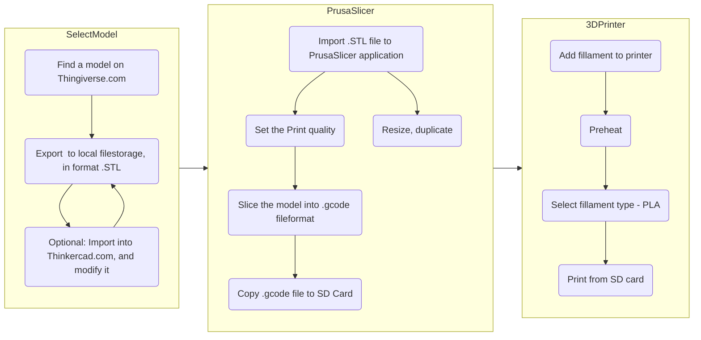

#playground

```mermaid
  flowchart LR;
    subgraph SelectModel
    direction TB
    A(Find a model on Thingiverse.com)
    C(Optional: Import into Thinkercad.com, and modify it)
    D(Export  to local filestorage, in format .STL)
    A-->D
    D-->C
    C-->D 
    end

    subgraph PrusaSlicer
    direction TB
    E(Import .STL file to PrusaSlicer application)
    E2(Resize, duplicate)
    F(Set the Print quality)
    G(Slice the model into .gcode fileformat)
    H(Copy .gcode file to SD Card)

    E-->F
    E-->E2
    F-->G
    G-->H
    end

    subgraph 3DPrinter
    direction TB
    I(Add fillament to printer)-->J(Preheat)
    J-->K(Select fillament type - PLA)
    K-->L(Print from SD card)
    end

  SelectModel-->PrusaSlicer-->3DPrinter

```
