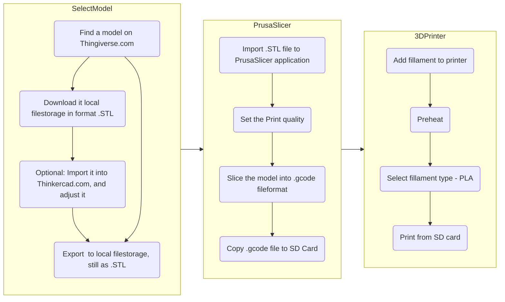

#playground

```mermaid
  flowchart LR;
    subgraph SelectModel
    direction TB
    A(Find a model on Thingiverse.com)-->B(Download it local filestorage in format .STL)
    B-->C(Optional: Import it into Thinkercad.com, and adjust it)
    C-->D(Export  to local filestorage, still as .STL)
    A-->D 
    end

    subgraph PrusaSlicer
    direction TB
    E(Import .STL file to PrusaSlicer application)-->F(Set the Print quality)
    F-->G(Slice the model into .gcode fileformat)
    G-->H(Copy .gcode file to SD Card)
    end

    subgraph 3DPrinter
    direction TB
    I(Add fillament to printer)-->J(Preheat)
    J-->K(Select fillament type - PLA)
    K-->L(Print from SD card)
    end

  SelectModel-->PrusaSlicer-->3DPrinter

```
