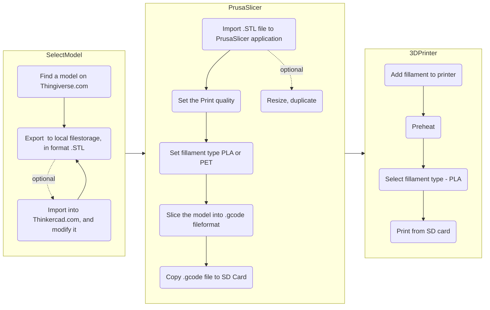

#playground

```mermaid
  flowchart LR;
    subgraph SelectModel
    direction TB
    A(Find a model on Thingiverse.com)
    C(Import into Thinkercad.com, and modify it)
    D(Export  to local filestorage, in format .STL)
    A-->D
    D-. optional .->C
    C-->D 
    end

    subgraph PrusaSlicer
    direction TB
    E(Import .STL file to PrusaSlicer application)
    E2(Resize, duplicate)
    F(Set the Print quality)
    F2(Set fillament type PLA or PET)
    G(Slice the model into .gcode fileformat)
    H(Copy .gcode file to SD Card)

    E-->F
    F-->F2
    E-. optional .->E2
    F2-->G
    G-->H
    end

    subgraph 3DPrinter
    direction TB
    I(Add fillament to printer)-->J(Preheat)
    J-->K(Select fillament type - PLA)
    K-->L(Print from SD card)
    end

  SelectModel-->PrusaSlicer-->3DPrinter

```
